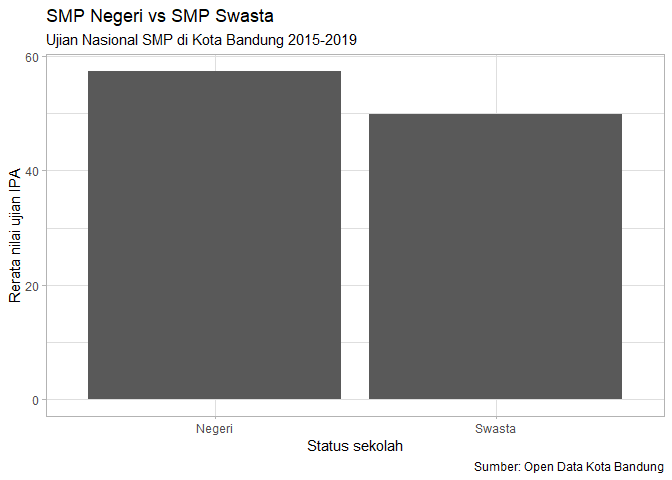
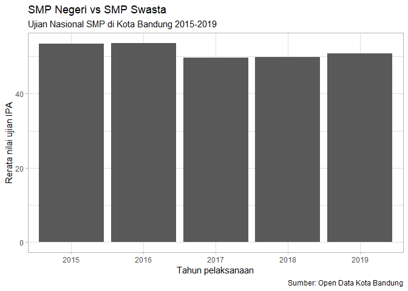

Supervised learning
================

<!-- Baris kode di atas merupakan pengaturan untuk dokumen R Markdown dan tidak akan tercetak pada berkas dokumen akhir -->

> Dalam modul ini Anda akan diajak untuk membuat pemodelan dan melakukan
> prediksi menggunakan model tersebut.

*Data modelling* dengan menggunakan pembelajaran mesin (*machine
learning*) merupakan aktivitas yang seringkali dilakukan dalam siklus
data science. Sangat menarik apabila memiliki kemampuan untuk membuat
prediksi suatu hal sehingga kita dapat melakukan persiapan lebih matang.

Bahasa pemrograman R memiliki fitur bawaan yang sangat mumpuni untuk
melakukan pembelajaran mesin. Selain itu terdapat sangat banyak
paket-paket tambahan lain yang dapat melengkapi dan memudahkan pengguna
untuk melakukan prediksi dengan menggunakan metode-metode mutakhir.

Namun keragaman dan banyaknya jumlah paket tersebut juga menyebabkan
adanya hambatan lain, yaitu hambatan pada alur kerja. Seringkali
beberapa paket memiliki tujuan dan metode yang sama namun menggunakan
istilah berbeda dalam argumen serta keluaran fungsinya. Selain itu juga
tidak jarang antar paket memiliki *API* yang berbeda-beda sehingga
pengguna harus menyesuaikan bentuk data sebelum dapat digunakan oleh
paket lainnya.

Dalam modul ini kita akan memanfaatkan sebuah “sistem” bernama
`tidymodels`. `tidymodels` dirancang untuk mengatasi permasalahan yang
disebutkan diatas sehingga pengguna dapat melakukan pembelajaran mesin
dengan lebih mudah. Silakan Anda aktifkan paket tersebut terlebih dahulu
beserta paket `vroom` dan `here`\!

``` r
library(vroom)
#> Warning: package 'vroom' was built under R version 3.6.3
library(here)
#> Warning: package 'here' was built under R version 3.6.3
#> here() starts at D:/Daigaku/praktikum2020
library(tidymodels)
#> Warning: package 'tidymodels' was built under R version 3.6.3
#> -- Attaching packages -------------------------------------------------- tidymodels 0.1.0 --
#> v broom     0.5.5      v recipes   0.1.10
#> v dials     0.0.5      v rsample   0.0.6 
#> v dplyr     0.8.5      v tibble    2.1.3 
#> v ggplot2   3.3.0      v tune      0.1.0 
#> v infer     0.5.1      v workflows 0.1.1 
#> v parsnip   0.0.5      v yardstick 0.0.6 
#> v purrr     0.3.3
#> Warning: package 'broom' was built under R version 3.6.3
#> Warning: package 'dials' was built under R version 3.6.3
#> Warning: package 'dplyr' was built under R version 3.6.3
#> Warning: package 'ggplot2' was built under R version 3.6.3
#> Warning: package 'infer' was built under R version 3.6.3
#> Warning: package 'parsnip' was built under R version 3.6.3
#> Warning: package 'purrr' was built under R version 3.6.3
#> Warning: package 'recipes' was built under R version 3.6.3
#> Warning: package 'rsample' was built under R version 3.6.3
#> Warning: package 'tune' was built under R version 3.6.3
#> Warning: package 'workflows' was built under R version 3.6.3
#> Warning: package 'yardstick' was built under R version 3.6.3
#> -- Conflicts ----------------------------------------------------- tidymodels_conflicts() --
#> x purrr::discard()  masks scales::discard()
#> x dplyr::filter()   masks stats::filter()
#> x dplyr::lag()      masks stats::lag()
#> x ggplot2::margin() masks dials::margin()
#> x yardstick::spec() masks vroom::spec()
#> x recipes::step()   masks stats::step()
```

Pada modul ini, kita akan langsung belajar menerapkan data modelling
melalui studi kasus. Dalam studi kasus pertama, kita akan melakukan
pemodelan dan prediksi untuk nilai ujian nasional tingkat SMP di Kota
Bandung. Imporlah “un\_smp.csv” yang berada dalam subdirektori
“data-raw” dan simpan sebagai obyek R bernama `un_smp`. Selanjutnya
jalankan fungsi `glimpse()` pada `un_smp` untuk mempelajari
strurukturnya. (Catatan: `glimpse()` adalah fungsi dari paket `dplyr`
yang serupa dengan fungsi `str()`)

``` r
un_smp <- vroom(here("data-raw", "un_smp.csv"))
#> Rows: 1,409
#> Columns: 8
#> Delimiter: ","
#> chr [2]: status, nama_sekolah
#> dbl [6]: tahun, jumlah_peserta, bahasa_indonesia, bahasa_inggris, matematika, ipa
#> 
#> Use `spec()` to retrieve the guessed column specification
#> Pass a specification to the `col_types` argument to quiet this message
glimpse(un_smp)
#> Observations: 1,409
#> Variables: 8
#> $ tahun            <dbl> 2015, 2015, 2015, 2015, 2015, 2015, 2015, 2015, 20...
#> $ status           <chr> "Negeri", "Negeri", "Negeri", "Negeri", "Negeri", ...
#> $ nama_sekolah     <chr> "SMP NEGERI 1 BANDUNG", "SMP NEGERI 2 BANDUNG", "S...
#> $ jumlah_peserta   <dbl> 441, 284, 291, 385, 333, 341, 352, 317, 450, 353, ...
#> $ bahasa_indonesia <dbl> 86.52, 86.35, 86.15, 84.51, 89.24, 77.16, 86.38, 8...
#> $ bahasa_inggris   <dbl> 82.32, 88.70, 81.45, 77.83, 91.29, 64.26, 86.28, 8...
#> $ matematika       <dbl> 76.55, 76.64, 75.71, 67.01, 83.17, 48.53, 75.88, 7...
#> $ ipa              <dbl> 76.85, 80.30, 74.76, 70.64, 84.02, 57.63, 79.03, 7...
```

Kita akan mencoba melakukan prediksi nilai ujian mata pelajaran IPA
(`ipa`) berdasarkan variabel-variabel lain, yaitu `tahun`, `status`,
`jumlah_peserta`, `bahasa_indonesia`, `bahasa_inggris`, dan
`matematika`. Sebelum itu kita perlu mengubah tipe variabel `tahun` dari
`dbl` menjadi `chr` sebagai berikut, cek hasil perubahannya dengan
fungsi `glimpse()`:

``` r
un_smp <- un_smp %>% 
  mutate(tahun = as.character(tahun))
glimpse(un_smp)
#> Observations: 1,409
#> Variables: 8
#> $ tahun            <chr> "2015", "2015", "2015", "2015", "2015", "2015", "2...
#> $ status           <chr> "Negeri", "Negeri", "Negeri", "Negeri", "Negeri", ...
#> $ nama_sekolah     <chr> "SMP NEGERI 1 BANDUNG", "SMP NEGERI 2 BANDUNG", "S...
#> $ jumlah_peserta   <dbl> 441, 284, 291, 385, 333, 341, 352, 317, 450, 353, ...
#> $ bahasa_indonesia <dbl> 86.52, 86.35, 86.15, 84.51, 89.24, 77.16, 86.38, 8...
#> $ bahasa_inggris   <dbl> 82.32, 88.70, 81.45, 77.83, 91.29, 64.26, 86.28, 8...
#> $ matematika       <dbl> 76.55, 76.64, 75.71, 67.01, 83.17, 48.53, 75.88, 7...
#> $ ipa              <dbl> 76.85, 80.30, 74.76, 70.64, 84.02, 57.63, 79.03, 7...
```

Mari kita coba membuat perbandingan nilai ujian IPA antara sekolah
negeri dan swasta. Perhatikan kode yang disajikan pada *chunk* berikut:

``` r
un_smp %>% 
  group_by(status) %>% 
  summarise(ipa = mean(ipa)) %>% 
  ggplot(aes(x = status, y = ipa)) +
  geom_col() + 
  labs(
    x = "Status sekolah",
    y = "Rerata nilai ujian IPA",
    title = "SMP Negeri vs SMP Swasta",
    subtitle = "Ujian Nasional SMP di Kota Bandung 2015-2019",
    caption = "Sumber: Open Data Kota Bandung"
  ) +
  theme_light()
```

<!-- -->

Melalui grafik yang dihasilkan pada script diatas, sebagai analisa awal,
dapat disimpulkan bahwa terdapat kemungkinan adanya pengaruh dari status
sekolah terhadap nilai ujian IPA. Sekarang buatlah grafik yang serupa
untuk mempelajari kemungkinan pengaruh dari tahun ujiandan menganalisa
kesimpulan apa yang dapat kita peroleh melalui grafik yang kita buat.

``` r
un_smp %>% 
  group_by(tahun) %>% 
  summarise(ipa = mean(ipa)) %>% 
  ggplot(aes(x = tahun, y = ipa)) +
  geom_col() + 
  labs(
    x = "Tahun pelaksanaan",
    y = "Rerata nilai ujian IPA",
    title = "SMP Negeri vs SMP Swasta",
    subtitle = "Ujian Nasional SMP di Kota Bandung 2015-2019",
    caption = "Sumber: Open Data Kota Bandung"
  ) +
  theme_light()
```

<!-- -->

Sebagai analisa lanjut, kita akan melakukan tahap pertama dari
pembelajaran mesin, yaitu membagi data yang kita miliki ke dalam dua
kelompok. Kelompok pertama disebut `data training` yang akan digunakan
untuk membuat pemodelan. Sedangkan kelompok kedua disebut `data testing`
yang akan digunakan untuk menguji performa model yang kita buat. Kita
akan memanfaatkan fungsi `initial_split()` dari paket `rsample` untuk
melakukan hal tersebut. Berapakah komposisi `training` terhadap
`testing` bawaan pada fungsi tersebut? (Petunjuk: `?initial_split`)

``` r
set.seed(270719)
un_smp_split <- initial_split(un_smp)
un_smp_split
#> <Training/Validation/Total>
#> <1057/352/1409>
```

`un_smp_split` merupakan obyek R yang memiliki metadata atau informasi
baris mana dari data `un_smp` yang akan digunakan sebagai `data
training` dan `data testing`. Kita dapat mengakses data `training`
dengan cara menjalankan fungsi `training()` pada `un_smp_split`. Fungsi
apakah yang akan digunakan untuk mengakses data `testing`? Coba buatlah
baris kode untuk itu\!

**data `training`**

``` r
training(un_smp_split) 
#> # A tibble: 1,057 x 8
#>    tahun status nama_sekolah jumlah_peserta bahasa_indonesia bahasa_inggris
#>    <chr> <chr>  <chr>                 <dbl>            <dbl>          <dbl>
#>  1 2015  Negeri SMP NEGERI ~            284             86.4           88.7
#>  2 2015  Negeri SMP NEGERI ~            291             86.2           81.4
#>  3 2015  Negeri SMP NEGERI ~            385             84.5           77.8
#>  4 2015  Negeri SMP NEGERI ~            333             89.2           91.3
#>  5 2015  Negeri SMP NEGERI ~            341             77.2           64.3
#>  6 2015  Negeri SMP NEGERI ~            352             86.4           86.3
#>  7 2015  Negeri SMP NEGERI ~            317             84.3           80.4
#>  8 2015  Negeri SMP NEGERI ~            353             78.4           70.3
#>  9 2015  Negeri SMP NEGERI ~            448             81.3           74.7
#> 10 2015  Negeri SMP NEGERI ~            443             84.9           79.9
#> # ... with 1,047 more rows, and 2 more variables: matematika <dbl>, ipa <dbl>
```

**data `testing`**

``` r
testing(un_smp_split)
#> # A tibble: 352 x 8
#>    tahun status nama_sekolah jumlah_peserta bahasa_indonesia bahasa_inggris
#>    <chr> <chr>  <chr>                 <dbl>            <dbl>          <dbl>
#>  1 2015  Negeri SMP NEGERI ~            441             86.5           82.3
#>  2 2015  Negeri SMP NEGERI ~            450             83.4           78.2
#>  3 2015  Negeri SMP NEGERI ~            282             77.7           63.4
#>  4 2015  Negeri SMP NEGERI ~            392             80.8           75.1
#>  5 2015  Negeri SMP NEGERI ~            420             81.5           75.5
#>  6 2015  Negeri SMP NEGERI ~            399             81.4           74.3
#>  7 2015  Negeri SMP NEGERI ~            285             81.3           75.3
#>  8 2015  Negeri SMP NEGERI ~            343             85.4           82.8
#>  9 2015  Negeri SMP NEGERI ~            342             76.6           61.9
#> 10 2015  Negeri SMP NEGERI ~            283             79.0           67.0
#> # ... with 342 more rows, and 2 more variables: matematika <dbl>, ipa <dbl>
```

Sebelum membuat pemodelan, biasanya kita akan melakukan pre-processing
pada data yang kita miliki terlebih dahulu. Hal tersebut penting
dilakukan agar data tersebut dapat memenuhi prasyarat sehingga algoritma
dari model dapat berjalan dengan baik dengan performa bagus. Contoh:
pada metode regresi linear diharapkan tidak terjadi *multicolinearity*
antar variabel prediktor; pada beberapa metode klasifikasi diharapkan
agar skala yang digunakan adalah sama untuk semua prediktor; dan
lain-lain.

Dalam `tidymodels` tahap pre-processing tersebut dianalogikan sebagai
“resep” sehingga dapat mudah dipahami. Kita dapat menggunakan fungsi
`recipe()`, `update_role()`, dan `step_*()` dari paket `recipes` untuk
membuat “resep” tersebut. Perhatikan baris kode berikut untuk membuat
“resep” berdasarkan data `training`:

``` r
un_smp_recipe <- training(un_smp_split) %>% 
  recipe() %>% 
  update_role(ipa, new_role = "outcome") %>% 
  update_role(tahun, status, jumlah_peserta, bahasa_indonesia, bahasa_inggris, matematika, new_role = "predictor") %>% 
  update_role(nama_sekolah, new_role = "ID") %>% 
  step_corr(all_predictors(), -tahun, -status)

un_smp_recipe
#> Data Recipe
#> 
#> Inputs:
#> 
#>       role #variables
#>         ID          1
#>    outcome          1
#>  predictor          6
#> 
#> Operations:
#> 
#> Correlation filter on all_predictors, -, tahun, -, status
summary(un_smp_recipe)
#> # A tibble: 8 x 4
#>   variable         type    role      source  
#>   <chr>            <chr>   <chr>     <chr>   
#> 1 tahun            nominal predictor original
#> 2 status           nominal predictor original
#> 3 nama_sekolah     nominal ID        original
#> 4 jumlah_peserta   numeric predictor original
#> 5 bahasa_indonesia numeric predictor original
#> 6 bahasa_inggris   numeric predictor original
#> 7 matematika       numeric predictor original
#> 8 ipa              numeric outcome   original
```

Berdasarkan keluaran fungsi di atas informasi apakah yang dapat kita
peroleh?

Tahap selanjutnya adalah kita harus menerapkan “resep” yang telah di
buat pada data yang kita miliki, baik pada data `training` maupun
`testing`. Hal tersebut dapat dilakukan dengan menggunakan fungsi
`prep()` dan `bake()` yang juga berasal dari paket `parsnip`. Setelah
“resep” diterapkan kita perlu menyimpan hasilnya sebagai obyek R untuk
selanjutnya malakukan pemodelan dan evaluasi performa. Perhatikan baris
kode berikut untuk menerapkan “resep” serta menyimpannya obyek R dengan
nama `un_smp_training` dan `un_smp_testing`. Jalankan `glimpse()` pada
dua obyek tersebut\! Dapatkah Anda menemukan perbedaan kedua obyek
tersebut dengan `training(un_smp_split)` dan `testing(un_smp_split)`?

``` r
un_smp_training <- un_smp_recipe %>% 
  prep() %>% 
  bake(training(un_smp_split))
glimpse(un_smp_training)
#> Observations: 1,057
#> Variables: 7
#> $ tahun            <fct> 2015, 2015, 2015, 2015, 2015, 2015, 2015, 2015, 20...
#> $ status           <fct> Negeri, Negeri, Negeri, Negeri, Negeri, Negeri, Ne...
#> $ nama_sekolah     <fct> SMP NEGERI 2 BANDUNG, SMP NEGERI 3 BANDUNG, SMP NE...
#> $ jumlah_peserta   <dbl> 284, 291, 385, 333, 341, 352, 317, 353, 448, 443, ...
#> $ bahasa_indonesia <dbl> 86.35, 86.15, 84.51, 89.24, 77.16, 86.38, 84.27, 7...
#> $ matematika       <dbl> 76.64, 75.71, 67.01, 83.17, 48.53, 75.88, 72.97, 6...
#> $ ipa              <dbl> 80.30, 74.76, 70.64, 84.02, 57.63, 79.03, 74.77, 6...

un_smp_testing <- un_smp_recipe %>% 
  prep() %>% 
  bake(testing(un_smp_split))
glimpse(un_smp_testing)
#> Observations: 352
#> Variables: 7
#> $ tahun            <fct> 2015, 2015, 2015, 2015, 2015, 2015, 2015, 2015, 20...
#> $ status           <fct> Negeri, Negeri, Negeri, Negeri, Negeri, Negeri, Ne...
#> $ nama_sekolah     <fct> SMP NEGERI 1 BANDUNG, SMP NEGERI 9 BANDUNG, SMP NE...
#> $ jumlah_peserta   <dbl> 441, 450, 282, 392, 420, 399, 285, 343, 342, 283, ...
#> $ bahasa_indonesia <dbl> 86.52, 83.44, 77.69, 80.80, 81.47, 81.42, 81.26, 8...
#> $ matematika       <dbl> 76.55, 67.56, 50.55, 60.96, 60.86, 64.20, 56.99, 7...
#> $ ipa              <dbl> 76.85, 71.58, 59.87, 64.95, 69.21, 67.22, 61.45, 7...
```

Setelah Anda membagi data awal menjadi dua `training` dan `testing`
serta menerapkan “resep” pra-pengolahan pada keduanya, sekarang saatnya
Anda melakukan pemodelan. Dalam studi kasus ini kita akan menggunakan
model Linear Regression

Pertama kita akan membuat model regresi sebagai berikut:

``` r
un_smp_lm <- linear_reg(mode = "regression") %>% 
  set_engine("lm") %>% 
  fit(ipa ~ . -nama_sekolah, data = un_smp_training)

un_smp_lm
#> parsnip model object
#> 
#> Fit time:  0ms 
#> 
#> Call:
#> stats::lm(formula = formula, data = data)
#> 
#> Coefficients:
#>      (Intercept)         tahun2016         tahun2017         tahun2018  
#>         0.255215          0.191104         -1.613745         -1.014704  
#>        tahun2019      statusSwasta    jumlah_peserta  bahasa_indonesia  
#>        -1.716086         -1.146398          0.002663          0.336238  
#>       matematika  
#>         0.612801
```

Selanjutnya kita akan menguji performa model tersebut dengan menggunakan
fungsi `metrics()` dari paket `yardstick`. Pengujian dilakukan terhadap
data `testing` seperti contoh di bawah ini:

``` r
un_smp_lm %>% 
  predict(un_smp_testing) %>% 
  bind_cols(un_smp_testing) %>% 
  metrics(truth = ipa, estimate = .pred)
#> # A tibble: 3 x 3
#>   .metric .estimator .estimate
#>   <chr>   <chr>          <dbl>
#> 1 rmse    standard       2.89 
#> 2 rsq     standard       0.945
#> 3 mae     standard       2.26
```

Kesimpulan apa yang dapat Anda ambil berdasarkan hasil diatas?

Sekarang buatlah pemodelan dan pengujian performa seperti di atas namun
menggunakan Random Forest\! (Petunjuk: fungsi `rand_forest()` dan
“mesin” adalah “ranger”)

``` r
un_smp_rf <- rand_forest(mode = "regression") %>% 
  set_engine("ranger") %>% 
  fit(ipa ~ . -nama_sekolah, data = un_smp_training)

un_smp_rf
#> parsnip model object
#> 
#> Fit time:  750ms 
#> Ranger result
#> 
#> Call:
#>  ranger::ranger(formula = formula, data = data, num.threads = 1,      verbose = FALSE, seed = sample.int(10^5, 1)) 
#> 
#> Type:                             Regression 
#> Number of trees:                  500 
#> Sample size:                      1057 
#> Number of independent variables:  5 
#> Mtry:                             2 
#> Target node size:                 5 
#> Variable importance mode:         none 
#> Splitrule:                        variance 
#> OOB prediction error (MSE):       8.321171 
#> R squared (OOB):                  0.9502359
```

``` r
un_smp_rf %>% 
  predict(un_smp_testing) %>% 
  bind_cols(un_smp_testing) %>% 
  metrics(truth = ipa, estimate = .pred)
#> # A tibble: 3 x 3
#>   .metric .estimator .estimate
#>   <chr>   <chr>          <dbl>
#> 1 rmse    standard       2.90 
#> 2 rsq     standard       0.944
#> 3 mae     standard       2.14
```

Kesimpulan apa yang dapat Anda ambil berdasarkan hasil diatas?

> Selamat Anda telah menyelesaikan modul Supervised Learning\! Silakan
> jalankan “Ctrl + Shift + K” atau klik tombol “Knit” untuk membuat
> dokumen final.
