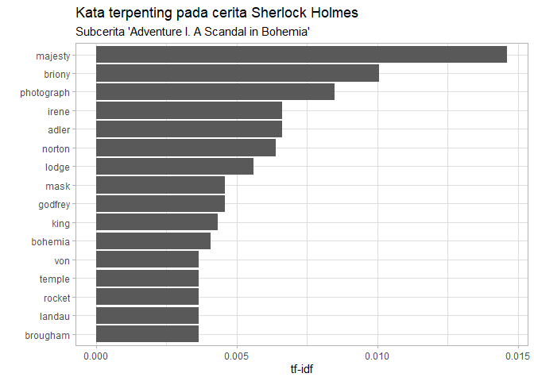
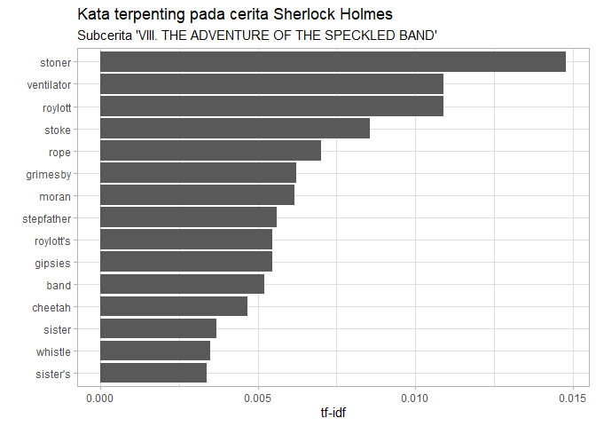
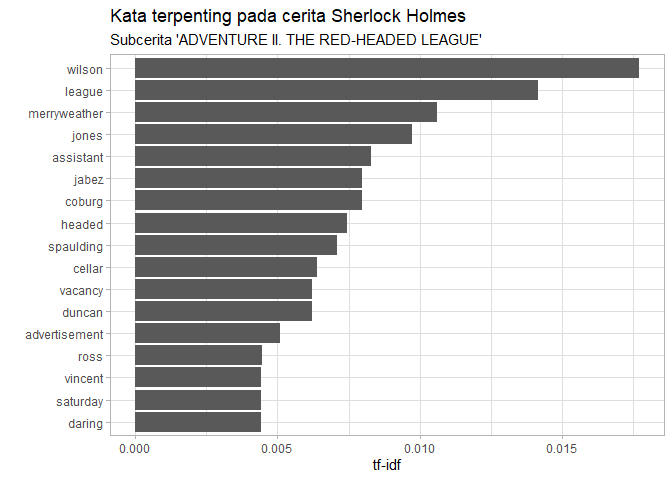
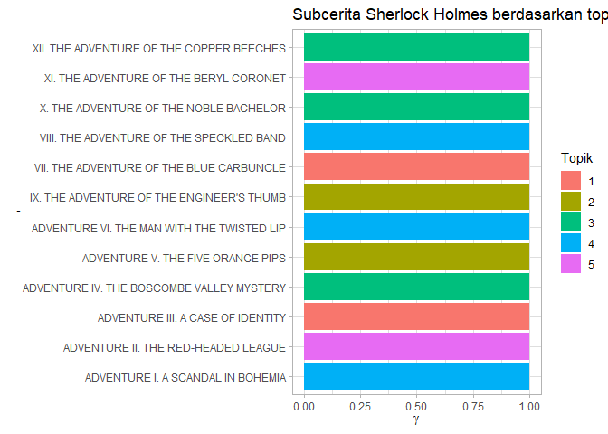
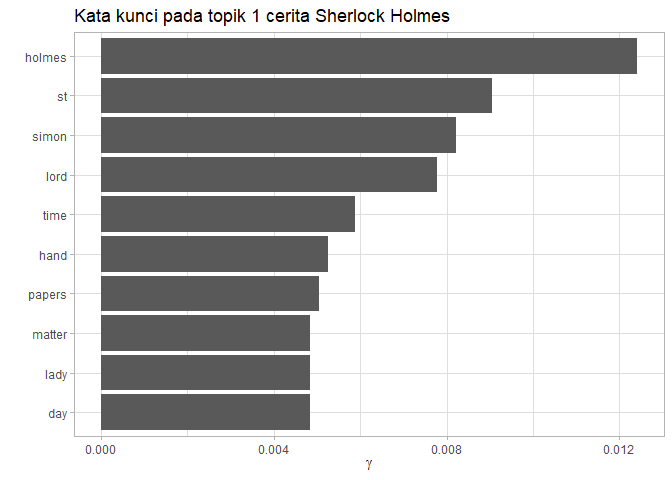

Unsupervised learning
================

<!-- Baris kode di atas merupakan pengaturan untuk dokumen R Markdown dan tidak akan tercetak pada berkas dokumen akhir -->

> Dalam modul ini Anda akan diajak untuk membuat pemodelan dan melakukan
> pengkategorian menggunakan model tersebut.

Kita mungkin sudah terbiasa membaca narasi teks, seperti artikel, cerita
pendek, cuitan twitter, atau bahkan buku dan novel. Seringkali secara
tidak sadar kita melakukan pengkategorian atas narasi-narasi yang
dibaca, bukan? Bagaimana caranya melakukan pengkategorian tersebut
dengan menggunakan mesin/komputer?

Dalam studi kasus selanjutnya kita akan melakukan pemodelan topik
(*topic modeling*) untuk mengkategorikan topik dari buku cerita. Kita
akan menggunakan beberapa paket untuk melakukan hal tersebut,
diantaranya adalah `tidytext` dan `topicmodels`. Selain kedua paket
tersebut aktifkanlah juga paket `vroom`, `here`, `dplyr`, dan
`ggplot2`\!

``` r
library(tidytext)
#> Warning: package 'tidytext' was built under R version 3.6.3
library(topicmodels)
#> Warning: package 'topicmodels' was built under R version 3.6.3
library(vroom)
#> Warning: package 'vroom' was built under R version 3.6.3
library(here)
#> Warning: package 'here' was built under R version 3.6.3
#> here() starts at D:/Daigaku/praktikum2020
library(dplyr)
#> Warning: package 'dplyr' was built under R version 3.6.3
#> 
#> Attaching package: 'dplyr'
#> The following objects are masked from 'package:stats':
#> 
#>     filter, lag
#> The following objects are masked from 'package:base':
#> 
#>     intersect, setdiff, setequal, union
library(ggplot2)
#> Warning: package 'ggplot2' was built under R version 3.6.3
```

Pada subdirektori “data-raw” terdapat berkas bernama “sherlock.csv”.
Imporlah berkas tersebut menjadi obyek R bernama `sherlock`. Kita akan
melakukan pengkategorian topik buku “The Adventures of Sherlock Holmes”
karya Arthur Conan Doyle. Jangan lupa untuk melakukan inspeksi terhadap
data `sherlock` tersebut.

``` r
sherlock <- vroom(here("data-raw", "sherlock.csv"))
#> Rows: 12,624
#> Columns: 2
#> Delimiter: ","
#> chr [2]: story, text
#> 
#> Use `spec()` to retrieve the guessed column specification
#> Pass a specification to the `col_types` argument to quiet this message
glimpse(sherlock)
#> Observations: 12,624
#> Variables: 2
#> $ story <chr> "ADVENTURE I. A SCANDAL IN BOHEMIA", "ADVENTURE I. A SCANDAL ...
#> $ text  <chr> "ADVENTURE I. A SCANDAL IN BOHEMIA", NA, "I.", NA, "To Sherlo...
```

Data `sherlock` tersebut berisi kolom “story” yang merupakan subcerita
dari cerita keseluruhan dan kolom “text” yang merupakan naskah cerita
pada setiap baris. Sekarang kita akan melakukan transformasi data untuk
mencatat kata apa saja yang muncul untuk setiap subcerita. Jalankan
*chunk* berikut dan simpanlah hasilnya sebagai obyek R bernama
`sherlock_tidy`\!

``` r
sherlock_tidy <- sherlock %>% 
  filter(!is.na(text)) %>% 
  group_by(story) %>%
  unnest_tokens(word, text) %>%
  ungroup() %>%
  anti_join(stop_words)
#> Joining, by = "word"

sherlock_tidy
#> # A tibble: 32,030 x 2
#>    story                             word     
#>    <chr>                             <chr>    
#>  1 ADVENTURE I. A SCANDAL IN BOHEMIA adventure
#>  2 ADVENTURE I. A SCANDAL IN BOHEMIA scandal  
#>  3 ADVENTURE I. A SCANDAL IN BOHEMIA bohemia  
#>  4 ADVENTURE I. A SCANDAL IN BOHEMIA sherlock 
#>  5 ADVENTURE I. A SCANDAL IN BOHEMIA holmes   
#>  6 ADVENTURE I. A SCANDAL IN BOHEMIA woman    
#>  7 ADVENTURE I. A SCANDAL IN BOHEMIA seldom   
#>  8 ADVENTURE I. A SCANDAL IN BOHEMIA heard    
#>  9 ADVENTURE I. A SCANDAL IN BOHEMIA mention  
#> 10 ADVENTURE I. A SCANDAL IN BOHEMIA eyes     
#> # ... with 32,020 more rows
```

Analisa apa saja yang dilakukan pada setiap tahap transformasi data
`sherlock` menjadi `sherlock_tidy`? Apa isi dari `stop_words`?

Kita dapat menghitung frekuensi penggunaan kata untuk setiap subcerita
dengan menggunakan fungsi `count()`. Tambahkanlah argumen untuk
mengurutkan frekuensi kata (`n`) dari paling tinggi hingga paling
rendah\!

``` r
sherlock_tidy %>% 
  count(story, word, sort = TRUE)
#> # A tibble: 17,774 x 3
#>    story                                     word       n
#>    <chr>                                     <chr>  <int>
#>  1 VIII. THE ADVENTURE OF THE SPECKLED BAND  holmes    56
#>  2 ADVENTURE II. THE RED-HEADED LEAGUE       holmes    53
#>  3 ADVENTURE I. A SCANDAL IN BOHEMIA         holmes    48
#>  4 ADVENTURE IV. THE BOSCOMBE VALLEY MYSTERY holmes    47
#>  5 ADVENTURE III. A CASE OF IDENTITY         holmes    46
#>  6 XII. THE ADVENTURE OF THE COPPER BEECHES  holmes    43
#>  7 X. THE ADVENTURE OF THE NOBLE BACHELOR    st        42
#>  8 X. THE ADVENTURE OF THE NOBLE BACHELOR    simon     39
#>  9 VII. THE ADVENTURE OF THE BLUE CARBUNCLE  holmes    38
#> 10 X. THE ADVENTURE OF THE NOBLE BACHELOR    lord      37
#> # ... with 17,764 more rows
```

Selanjutnya Kita dapat dapat mengetahui kata penting apa yang terdapat
dapat suatu subcerita dengan menggunakan analisis Term Frequency -
Inverse Document Frequency (tf-idf). Fungsi `bind_tf_idf()` dapat
dimanfaatkan untuk melakukan hal tersebut. Simpanlah hasil keluaran
fungsi tersebut dalam obyek bernama `sherlock_tfidf` dan cetaklah
hasilnya pada layar\!

``` r
sherlock_tfidf <- sherlock_tidy %>% 
  count(story, word, sort = TRUE) %>% 
  bind_tf_idf(word, story, n)

sherlock_tfidf
#> # A tibble: 17,774 x 6
#>    story                                     word       n     tf   idf  tf_idf
#>    <chr>                                     <chr>  <int>  <dbl> <dbl>   <dbl>
#>  1 VIII. THE ADVENTURE OF THE SPECKLED BAND  holmes    56 0.0175 0     0      
#>  2 ADVENTURE II. THE RED-HEADED LEAGUE       holmes    53 0.0189 0     0      
#>  3 ADVENTURE I. A SCANDAL IN BOHEMIA         holmes    48 0.0177 0     0      
#>  4 ADVENTURE IV. THE BOSCOMBE VALLEY MYSTERY holmes    47 0.0164 0     0      
#>  5 ADVENTURE III. A CASE OF IDENTITY         holmes    46 0.0222 0     0      
#>  6 XII. THE ADVENTURE OF THE COPPER BEECHES  holmes    43 0.0147 0     0      
#>  7 X. THE ADVENTURE OF THE NOBLE BACHELOR    st        42 0.0168 0.539 0.00906
#>  8 X. THE ADVENTURE OF THE NOBLE BACHELOR    simon     39 0.0156 2.48  0.0388 
#>  9 VII. THE ADVENTURE OF THE BLUE CARBUNCLE  holmes    38 0.0155 0     0      
#> 10 X. THE ADVENTURE OF THE NOBLE BACHELOR    lord      37 0.0148 0.875 0.0130 
#> # ... with 17,764 more rows
```

`sherlock_tfidf` tersebut akan lebih mudah dicerna jika ditampilkan
dalam bentuk grafik. Pada *chunk* berikut kita akan memvisualisasikan
data tersebut dengan menampilkan 15 kata terpenting untuk sucerita
“ADVENTURE I. A SCANDAL IN BOHEMIA”

``` r
sherlock_tfidf %>% 
  filter(story == "ADVENTURE I. A SCANDAL IN BOHEMIA") %>% 
  top_n(15, tf_idf) %>% 
  ggplot(aes(x = reorder(word, tf_idf), y = tf_idf)) +
  geom_col() +
  coord_flip() +
  labs(
    x = "",
    y = "tf-idf",
    title = "Kata terpenting pada cerita Sherlock Holmes",
    subtitle = "Subcerita 'Adventure I. A Scandal in Bohemia'"
  ) +
  theme_light()
```

<!-- -->

Pilihlah dua subcerita lain dan buatlah grafik serupa\!

``` r
sherlock_tfidf %>% 
  filter(story == "VIII. THE ADVENTURE OF THE SPECKLED BAND") %>% 
  top_n(15, tf_idf) %>% 
  ggplot(aes(x = reorder(word, tf_idf), y = tf_idf)) +
  geom_col() +
  coord_flip() +
  labs(
    x = "",
    y = "tf-idf",
    title = "Kata terpenting pada cerita Sherlock Holmes",
    subtitle = "Subcerita 'VIII. THE ADVENTURE OF THE SPECKLED BAND'"
  ) +
  theme_light()
```

<!-- -->

``` r
sherlock_tfidf %>% 
  filter(story == "ADVENTURE II. THE RED-HEADED LEAGUE") %>% 
  top_n(15, tf_idf) %>% 
  ggplot(aes(x = reorder(word, tf_idf), y = tf_idf)) +
  geom_col() +
  coord_flip() +
  labs(
    x = "",
    y = "tf-idf",
    title = "Kata terpenting pada cerita Sherlock Holmes",
    subtitle = "Subcerita 'ADVENTURE II. THE RED-HEADED LEAGUE'"
  ) +
  theme_light()
```

<!-- -->

Berdasarkan analisis tf-idf di atas kita dapat melihat bahwa masih
banyak kata yang merupakan nama tokoh dalam cerita termasuk dalam kata
penting. Apakah sebaiknya kita menghapus kata-kata tersebut terlebih
dahulu sebelum melakukan pemodelan topik?

Sekarang kita akan mulai melakukan pemodelan topik. Adapun algoritma
yang akan kita pergunakan adalah Latent Dirichlet allocation (LDA). LDA
merupakan algoritma yang biasa digunakan dalam pemodelan topik. Untuk
menjalankan algoritma LDA dari paket `topicmodels`, `sherlock_tidy`
harus diubah menjadi obyek berjenis DocumentTermMatrix dengan cara
sebagai berikut:

``` r
sherlock_dtm <- sherlock_tidy %>% 
  count(story, word) %>% 
  cast_dtm(story, word, n)

sherlock_dtm
#> <<DocumentTermMatrix (documents: 12, terms: 7438)>>
#> Non-/sparse entries: 17774/71482
#> Sparsity           : 80%
#> Maximal term length: 18
#> Weighting          : term frequency (tf)
```

Selanjutnya kita dapat mengimplementasikan algoritma LDA dengan
menggunakan fungsi `LDA()`. Pada fungsi ini kita harus menentukan nilai
k, yaitu jumlah kategori topik yang diinginkan. Sebagai contoh kita akan
menggunakan nilai k = 5.

``` r
sherlock_lda <- LDA(sherlock_dtm, k = 5)

sherlock_lda
#> A LDA_VEM topic model with 5 topics.
```

Bagaimanakah kategorisasi subcerita Sherlock Holmes dalam 5 topik yang
telah kita buat pemodelannya tersebut? Kita dapat mengetahuinya dengan
cara mengamati peluang suatu topik per dokumen yang dinyatakan sebagai
nilai \(gamma\). Fungsi `tidy()` dari paket `broom` dapat digunakan
untuk melakukan hal tersebut. Perhatikan contoh di bawah ini:

``` r
sherlock_gamma <- sherlock_lda %>% 
  tidy(matrix = "gamma") %>% 
  rename(story = document) %>% 
  arrange(story, desc(gamma))

sherlock_gamma
#> # A tibble: 60 x 3
#>    story                               topic      gamma
#>    <chr>                               <int>      <dbl>
#>  1 ADVENTURE I. A SCANDAL IN BOHEMIA       3 1.00      
#>  2 ADVENTURE I. A SCANDAL IN BOHEMIA       1 0.00000474
#>  3 ADVENTURE I. A SCANDAL IN BOHEMIA       2 0.00000474
#>  4 ADVENTURE I. A SCANDAL IN BOHEMIA       5 0.00000474
#>  5 ADVENTURE I. A SCANDAL IN BOHEMIA       4 0.00000474
#>  6 ADVENTURE II. THE RED-HEADED LEAGUE     5 1.00      
#>  7 ADVENTURE II. THE RED-HEADED LEAGUE     1 0.00000459
#>  8 ADVENTURE II. THE RED-HEADED LEAGUE     2 0.00000459
#>  9 ADVENTURE II. THE RED-HEADED LEAGUE     4 0.00000459
#> 10 ADVENTURE II. THE RED-HEADED LEAGUE     3 0.00000459
#> # ... with 50 more rows
```

Kesimpulan apa yang dapat Anda tarik berdasarkan `sherlock_gamma` di
atas?

Anda juga dapat membuat visualisasi untuk `sherlock_gamma` seperti
ditunjukan pada *chunk* di bawah. Silakan Anda berikan kostumisasi pada
grafik tersebut\!

``` r
sherlock_gamma %>% 
  ggplot(aes(x = rev(story), y = gamma, fill = factor(topic))) +
  geom_col() +
  coord_flip() +
  labs(
    x = ",",
    y = expression(gamma),
    title = "Subcerita Sherlock Holmes berdasarkan topik",
    fill = "Topik"
  ) +
  theme_light()
```

<!-- -->

Agar dapat memahami makna dari setiap topik, Anda dapat menghimpun
kata-kata apa saja yang menjadi kunci dalam suatu topik. Hal tersebut
dapat dilakukan dengan cara mengekstrak probabilitas kata dalam suatu
topik yang dinyatakan sebagai nilai \(beta\). Dalam *chunk* berikut kita
akan menggunakan fungsi `tidy()` dari paket `broom` untuk mengekstrak
nilai \(beta\) dan selanjutnya menampilkan 10 kata teratas dari setiap
topik:

``` r
sherlock_beta <- sherlock_lda %>% 
  tidy(matrix = "beta") %>% 
  rename(word = term) %>% 
  arrange(topic, desc(beta))

sherlock_beta
#> # A tibble: 37,190 x 3
#>    topic word      beta
#>    <int> <chr>    <dbl>
#>  1     1 holmes 0.0124 
#>  2     1 st     0.00905
#>  3     1 simon  0.00821
#>  4     1 lord   0.00779
#>  5     1 time   0.00589
#>  6     1 hand   0.00526
#>  7     1 papers 0.00505
#>  8     1 day    0.00484
#>  9     1 lady   0.00484
#> 10     1 matter 0.00484
#> # ... with 37,180 more rows

sherlock_beta %>% 
  group_by(topic) %>% 
  top_n(10, beta)  
#> # A tibble: 51 x 3
#> # Groups:   topic [5]
#>    topic word      beta
#>    <int> <chr>    <dbl>
#>  1     1 holmes 0.0124 
#>  2     1 st     0.00905
#>  3     1 simon  0.00821
#>  4     1 lord   0.00779
#>  5     1 time   0.00589
#>  6     1 hand   0.00526
#>  7     1 papers 0.00505
#>  8     1 day    0.00484
#>  9     1 lady   0.00484
#> 10     1 matter 0.00484
#> # ... with 41 more rows
```

Dapatkah Anda membuat visualisasi untuk `sherlock_beta`? Buatlah
visualisasi untuk setidaknya 3 topik\! (Petunjuk: baris kode serupa
dengan kode untuk membuat visualisasi `sherlock_tfidf`)

``` r
sherlock_beta %>% 
  filter(topic == 1) %>% 
  top_n(10, beta) %>% 
  ggplot(aes(x = reorder(word, beta), y = beta)) +
  geom_col() +
  coord_flip() +
  labs(
    x = "",
    y = expression(gamma),
    title = "Kata kunci pada topik 1 cerita Sherlock Holmes"
  ) +
  theme_light()
```

<!-- -->

Berikan interpretasi Anda terhadap hasil-hasil yang telah Anda dapatkan
di atas\!

> Selamat Anda telah menyelesaikan modul Unsupervised Learning\! Silakan
> jalankan “Ctrl + Shift + K” atau klik tombol “Knit” untuk membuat
> dokumen final.
