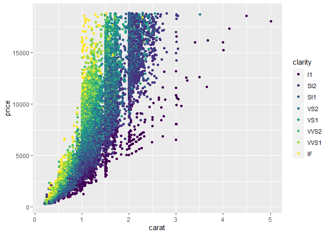

Grammar of graphic for data visualisation
================

<!-- Baris kode di atas merupakan pengaturan untuk dokumen R Markdown dan tidak akan tercetak pada berkas dokumen akhir -->

> Dalam modul ini Anda akan menggunakan konsep Grammar of Graphics untuk
> membuat visualisasi data.

R merupakan bahasa pemrograman yang terkenal akan kemampuannya dalam
menghasilkan grafik atau visualisasi data dengan baik. Penting diketahui
bahwa R memiliki berbagai sistem dan paket untuk pembuatan grafik,
contohnya `base`, `lattice`, `ggplot`, dan lain-lain. Namun dalam modul
ini Akita akan fokus menggunakan sistem `ggplot` untuk membuat
visualisasi data.

Sistem pembuatan grafik dengan `ggplot` dapat dilakukan dengan
menggunakan paket `ggplot2` yang merupakan implementasi dari konsep
*Grammar of graphic* untuk bahasa pemrograman R. Dengan memahami konsep
dari *grammar of graphic*, kita dapat membuat berbagai jenis plot dengan
ringkas dan mudah. Sekarang aktifkanlah paket `ggplot2` tersebut
terlebih dahulu\!

``` r
library(ggplot2)
#> Warning: package 'ggplot2' was built under R version 3.6.3
```

Dalam contoh ini Anda akan membuat grafik dari dataset `diamonds` yang
tersedia dalam paket `ggplot2`. Anda dapat melihat isi serta dokumentasi
dari dataset tersebut dengan menjalankan `diamonds` dan `?diamonds`.
Berisi informasi apakah data `diamonds`? Silakan lakukan inspeksi pada
struktur data tersebut\!

``` r
diamonds
#> # A tibble: 53,940 x 10
#>    carat cut       color clarity depth table price     x     y     z
#>    <dbl> <ord>     <ord> <ord>   <dbl> <dbl> <int> <dbl> <dbl> <dbl>
#>  1 0.23  Ideal     E     SI2      61.5    55   326  3.95  3.98  2.43
#>  2 0.21  Premium   E     SI1      59.8    61   326  3.89  3.84  2.31
#>  3 0.23  Good      E     VS1      56.9    65   327  4.05  4.07  2.31
#>  4 0.290 Premium   I     VS2      62.4    58   334  4.2   4.23  2.63
#>  5 0.31  Good      J     SI2      63.3    58   335  4.34  4.35  2.75
#>  6 0.24  Very Good J     VVS2     62.8    57   336  3.94  3.96  2.48
#>  7 0.24  Very Good I     VVS1     62.3    57   336  3.95  3.98  2.47
#>  8 0.26  Very Good H     SI1      61.9    55   337  4.07  4.11  2.53
#>  9 0.22  Fair      E     VS2      65.1    61   337  3.87  3.78  2.49
#> 10 0.23  Very Good H     VS1      59.4    61   338  4     4.05  2.39
#> # ... with 53,930 more rows
?diamonds
#> starting httpd help server ... done
str(diamonds)
#> Classes 'tbl_df', 'tbl' and 'data.frame':    53940 obs. of  10 variables:
#>  $ carat  : num  0.23 0.21 0.23 0.29 0.31 0.24 0.24 0.26 0.22 0.23 ...
#>  $ cut    : Ord.factor w/ 5 levels "Fair"<"Good"<..: 5 4 2 4 2 3 3 3 1 3 ...
#>  $ color  : Ord.factor w/ 7 levels "D"<"E"<"F"<"G"<..: 2 2 2 6 7 7 6 5 2 5 ...
#>  $ clarity: Ord.factor w/ 8 levels "I1"<"SI2"<"SI1"<..: 2 3 5 4 2 6 7 3 4 5 ...
#>  $ depth  : num  61.5 59.8 56.9 62.4 63.3 62.8 62.3 61.9 65.1 59.4 ...
#>  $ table  : num  55 61 65 58 58 57 57 55 61 61 ...
#>  $ price  : int  326 326 327 334 335 336 336 337 337 338 ...
#>  $ x      : num  3.95 3.89 4.05 4.2 4.34 3.94 3.95 4.07 3.87 4 ...
#>  $ y      : num  3.98 3.84 4.07 4.23 4.35 3.96 3.98 4.11 3.78 4.05 ...
#>  $ z      : num  2.43 2.31 2.31 2.63 2.75 2.48 2.47 2.53 2.49 2.39 ...
```

Kita dapat menggunakan fungsi `qplot()` untuk membuat grafik menggunakan
`ggplot2`. Bacalah terlebih dahulu dokumentasi fungsi `qplot()` dan
kemudian lengkapilah *chunk* berikut untuk membuat grafik hubungan
antara berat (sumbu x), harga (sumbu y) dan kejernihan intan (variasi
warna) dari dataset diamonds\!

``` r
qplot(x = carat, y = price, colour = clarity, data = diamonds)
```

<!-- -->

Pembuatan grafik dengan menggunakan fungsi `qplot()` memang relatif
mudah, namun fiturnya terbatas dan kurang fleksibel. Oleh karena itu,
kita akan mempelajari dan menggunakan fungsi `ggplot()` untuk membuat
visualisasi data dengan lebih leluasa. Grafik diatas dapat diolah
kembali dengan menggunakan penulisan kode sebagai berikut::

``` r
ggplot(data = diamonds, mapping = aes(x = carat, y = price, colour = clarity)) +
  geom_point()
```

<!-- -->

Hal yang menarik dan membedakan antara pembuatan grafik menggunakan
`ggplot2` dan `base` adalah bahwa keluaran fungsi `ggplot()` dapat
disimpan sebagai obyek R. Apa manfaatnya? Pertama adalah kita dapat
dengan mudah menyimpan grafik seperti halnya menjalankan `write.csv()`
pada dataset. Kedua adalah kita dapat dengan leluasa melakukan
modifikasi pada grafik yang telah dibuat. Hal ini akan dibahas dalam
subbagian kedepan.

Baris kode dalam *chunk* berikut menunjukan cara untuk menyimpan grafik
ke dalam obyek R bernama `plot_diamonds` dan kemudian menyimpannya dalam
komputer dengan nama berkas “diamonds.png”. Kita akan menggunakan fungsi
`ggsave()` yang juga berasal dari paket `ggplot2`.

``` r
plot_diamonds <- ggplot(data = diamonds) +
  geom_point(mapping = aes(x = carat, y = price, colour = clarity)) # Saat output disimpan ke dalam obyek R, grafik tidak otomatis dicetak pada layar

plot_diamonds # Untuk mencetak grafik, Anda harus menjalankan nama obyek R yang sebelumnya dibuat
```

<!-- -->

``` r

ggsave(filename = "diamonds.png", plot = plot_diamonds)
#> Saving 7 x 5 in image
```

Meskipun penulisan kode R untuk membuat grafik menggunakan fungsi
`ggplot()` relatif lebih panjang, lebih banyak kostumisasi dan
pengaturan grafik yang dapat dilakukan dengan menggunakan fungsi
`ggplot()` dibandingkan fungsi `qplot()`. Dalam pelatihan ini Anda akan
diminta untuk membuat banyak grafik dengan menggunakan struktur
penulisan kode sebagai berikut:

    ggplot(data = <DATA>) +
      <GEOM_FUNCTION>(mapping = aes(<MAPPINGS>))

Dapat ditarik kesimpulan berdasarkan struktur penulisan kode R di atas
bahwa setidaknya terdapat tiga komponen utama untuk membuat grafik,
yaitu:

1.  *Data*
2.  *Aesthetic mapping*
3.  *Geometric object*

Pelajarilah dokumentasi fungsi `aes()` dan `geom_point()` (sebagai salah
satu contoh *geometric object*) melalui kode berikut\!

``` r
?aes
?geom_point
```

Selanjutnya kita akan bereksperimen membuat visualisasi data Ujian
Nasional tingkat SMP di Kota Bandung yang disediakan oleh [Open Data
Kota Bandung](http://data.bandung.go.id). Data tersebut tersedia sebagai
berkas “un\_smp.csv” dalam subdirektori “data-raw”. Silakan impor data
tersebut sebagai obyek R bernama `un_smp` menggunakan fungsi `vroom()`
dan `here()` dan cetaklah pada layar\! (Petunjuk: aktifkan terlebih
dahulu paket-paket yang relevan)

``` r
library(vroom)
#> Warning: package 'vroom' was built under R version 3.6.3
library(here)
#> Warning: package 'here' was built under R version 3.6.3
#> here() starts at D:/Daigaku/praktikum2020
```

``` r
un_smp <- vroom(here("data-raw", "un_smp.csv"))
#> Rows: 1,409
#> Columns: 8
#> Delimiter: ","
#> chr [2]: status, nama_sekolah
#> dbl [6]: tahun, jumlah_peserta, bahasa_indonesia, bahasa_inggris, matematika, ipa
#> 
#> Use `spec()` to retrieve the guessed column specification
#> Pass a specification to the `col_types` argument to quiet this message
un_smp
#> # A tibble: 1,409 x 8
#>    tahun status nama_sekolah jumlah_peserta bahasa_indonesia bahasa_inggris
#>    <dbl> <chr>  <chr>                 <dbl>            <dbl>          <dbl>
#>  1  2015 Negeri SMP NEGERI ~            441             86.5           82.3
#>  2  2015 Negeri SMP NEGERI ~            284             86.4           88.7
#>  3  2015 Negeri SMP NEGERI ~            291             86.2           81.4
#>  4  2015 Negeri SMP NEGERI ~            385             84.5           77.8
#>  5  2015 Negeri SMP NEGERI ~            333             89.2           91.3
#>  6  2015 Negeri SMP NEGERI ~            341             77.2           64.3
#>  7  2015 Negeri SMP NEGERI ~            352             86.4           86.3
#>  8  2015 Negeri SMP NEGERI ~            317             84.3           80.4
#>  9  2015 Negeri SMP NEGERI ~            450             83.4           78.2
#> 10  2015 Negeri SMP NEGERI ~            353             78.4           70.3
#> # ... with 1,399 more rows, and 2 more variables: matematika <dbl>, ipa <dbl>
```

Pelajarilah struktur data `un_smp` tersebut. Ada berapa observasi dan
variabel yang tersedia? Apa saja nama dari setiap kolom? Data tahun
berapa sajakah yang tersedia pada data tersebut? Jumlah Variable = 8

``` r
ncol(un_smp)
#> [1] 8
str(un_smp)
#> Classes 'tbl_df', 'tbl' and 'data.frame':    1409 obs. of  8 variables:
#>  $ tahun           : num  2015 2015 2015 2015 2015 ...
#>  $ status          : chr  "Negeri" "Negeri" "Negeri" "Negeri" ...
#>  $ nama_sekolah    : chr  "SMP NEGERI 1 BANDUNG" "SMP NEGERI 2 BANDUNG" "SMP NEGERI 3 BANDUNG" "SMP NEGERI 4 BANDUNG" ...
#>  $ jumlah_peserta  : num  441 284 291 385 333 341 352 317 450 353 ...
#>  $ bahasa_indonesia: num  86.5 86.3 86.2 84.5 89.2 ...
#>  $ bahasa_inggris  : num  82.3 88.7 81.5 77.8 91.3 ...
#>  $ matematika      : num  76.5 76.6 75.7 67 83.2 ...
#>  $ ipa             : num  76.8 80.3 74.8 70.6 84 ...
#>  - attr(*, "spec")=
#>   .. cols(
#>   ..   tahun = col_double(),
#>   ..   status = col_character(),
#>   ..   nama_sekolah = col_character(),
#>   ..   jumlah_peserta = col_double(),
#>   ..   bahasa_indonesia = col_double(),
#>   ..   bahasa_inggris = col_double(),
#>   ..   matematika = col_double(),
#>   ..   ipa = col_double(),
#>   ..   .delim = ","
#>   .. )
```

Dalam modul ini kita akan membuat visualisasi hubungan antara nilai UN
mata pelajaran matematika dan bahasa Indonesia. Namun sebelum itu,
penting untuk diingat bahwa dalam sistem `ggplot2` suatu grafik dibangun
atas tiga komponen utama yaitu *data*, *aesthetic mapping*, dan
*geometric objects*. Komponen pertama (*data*) dapat diatur dengan
menggunakan baris kode berikut:

``` r
ggplot(un_smp)
```

<!-- -->

Selanjutnya kita perlu mendefinisikan dimensi mana dari data yang ingin
digambarkan dalam grafik. Pendefinisian ini dilakukan dalam komponen
*aesthetic mapping* (`aes()`). Kita diminta untuk mempelajari hubungan
antara nilai UN matematika versus bahasa Indonesia. Untuk itu, kita
dapat mendefinisikan variabel `bahasa_indonesia` pada sumbu x dan
`matematika` pada sumbu y.

``` r
ggplot(un_smp, aes(x = bahasa_indonesia, y = matematika))
```

<!-- -->

Pendefinisian sumbu x dan y telah menghasilkan *layer* baru dalam
grafik. Namun, kita masih perlu mendefinisikan bentuk dari grafik
tersebut melalui komponen *geometric objects* (`geom_*()`) sebelum
grafik tersebut dapat dibaca. Tambahkan obyek geometri berupa titik di
atas *layers* yang telah dibuat sebelumnya\!

``` r
ggplot(un_smp, aes(x = bahasa_indonesia, y = matematika)) + 
geom_point()
```

<!-- -->

Selamat sekarang grafik tersebut mulai dapat terbaca\! Sekarang kita
ingin mengetahui bagaimanakah representasi dari status sekolah (Negeri
vs Swasta) pada grafik. Kita dapat menambahkan fungsi `aes()` pada obyek
geometri untuk melakukan hal tersebut. Dalam contoh ini kita akan
menggunakan *aesthetic* berupa warna titik untuk membedakan antar status
sekolah.

``` r
ggplot(un_smp, aes(x = bahasa_indonesia, y = matematika)) +
geom_point(aes(colour = status))
```

<!-- -->

Mudah sekali bukan? Bagaimana jika Anda ingin menambahkan informasi
jumlah peserta ujian yang direpresentasikan oleh ukuran titik dalam
grafik tersebut?

``` r
ggplot(un_smp, aes(x = bahasa_indonesia, y = matematika)) +
geom_point(aes(colour = status, size = jumlah_peserta))
```

<!-- -->

Nampaknya jumlah peserta ujian juga memiliki hubungan dengan nilai
ujian, benarkah? Namun sayang sekali grafik tersebut sekarang telihat
sangat “penuh” sehingga sulit membedakan antar titik. Apakah transparasi
titik-titik tersebut dapat dimodifikasi? Ya\! Anda dapat menambahkan
argumen “alpha” (nilai 0 hingga 1) pada obyek geometri yang diinginkan.
(Pertanyaan: Apa yang terjadi jika Anda menambahkan argumen “alpha”
dalam fungsi `aes()` pada obyek geometri?) jadi seperti transparan

``` r
ggplot(un_smp, aes(x = bahasa_indonesia, y = matematika)) +
geom_point(aes(colour = status, size = jumlah_peserta), alpha = 0.2)
```

<!-- -->

Selanjutnya, kita ingin menganalisa lebih lanjut bagaimanakah hubungan
antar nilai ujian nasional tersebut jika dibagi per kelompok tahun.
Karena Anda sudah menggunakan empat dimensi untuk mempresentasikan data
(sumbu x, sumbu y, warna titik, ukuran titik), sekarang mungkin saatnya
Anda menggunakan pendekatan berbeda yaitu menggunakan *facet*\!
Tambahkanlah baris kode `facet_wrap(~tahun, scales = "free")` pada
*chunk* berikut\!

``` r
ggplot(un_smp, aes(x = bahasa_indonesia, y = matematika)) +
geom_point(aes(colour = status, size = jumlah_peserta), alpha = 0.2) +
facet_wrap(~tahun, scales = "free")
```

<!-- -->

Hasil visualisasi telah dapat memberikan analisa baru yang dapat kita
buat, Namun sayangnya Anda masih belum puas dengan grafik tersebut dalam
hal estetika. Lengkapilah *chunk* berikut untuk melakukan modifikasi
estetika pada grafik tersebut\! kemudian simpanlah grafik tersebut dalam
obyek R dengan nama `mtk_vs_ind` dan jangan lupa cetak hasilnya pada
layar.

``` r
mtk_vs_ind <- ggplot(un_smp, aes(x = bahasa_indonesia, y = matematika)) +
geom_point(aes(colour = status, size = jumlah_peserta), alpha = 0.2) +
facet_wrap(~tahun, scales = "free") +
labs(
x = "Bahasa Indonesia",
y = "Matematika",
colour = "Status sekolah",
size = "# peserta",
title = "____________________________________",
subtitle = "Ujian Nasional SMP di Kota Bandung 2015-2019",
caption = "Sumber: Open Data Kota Bandung"
) +
theme_light()
mtk_vs_ind
```

<!-- -->

Sekarang saatnya menyimpan grafik tersebut.

``` r
ggsave("grafikunsmp.png", plot = mtk_vs_ind)
#> Saving 7 x 5 in image
```

Selamat Anda telah berhasil membuat visualisasi untuk data `un_smp`.
Silakan Anda bereksperimen membuat grafik dengan variabel-variabel lain
atau bahkan menggunakan obyek geometri lainnya untuk menghasilkan
visulisasi data yang berbeda.

> Selamat Anda telah menyelesaikan modul ini\! Silakan jalankan “Ctrl +
> Shift + K” atau klik tombol “Knit” untuk membuat dokumen final.
